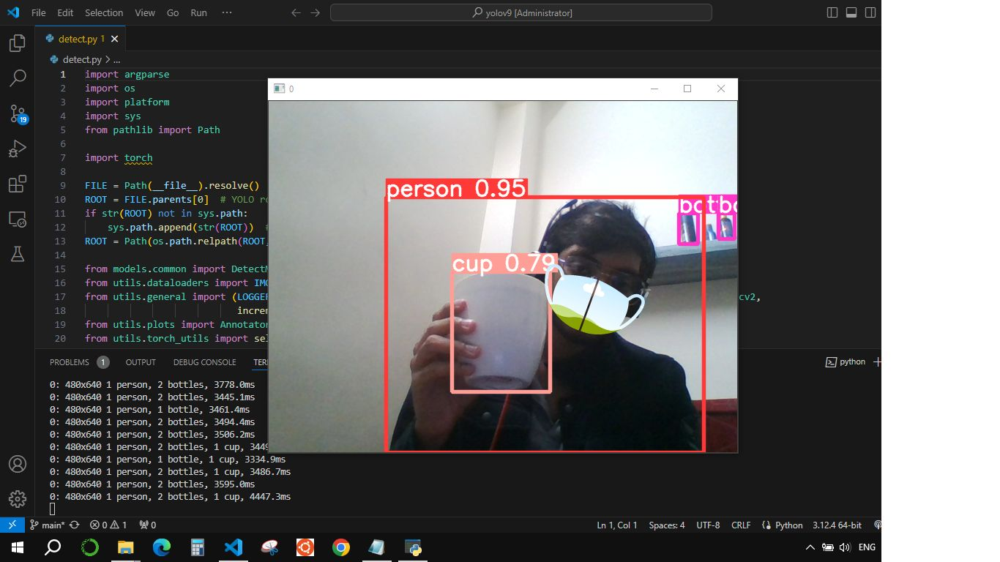
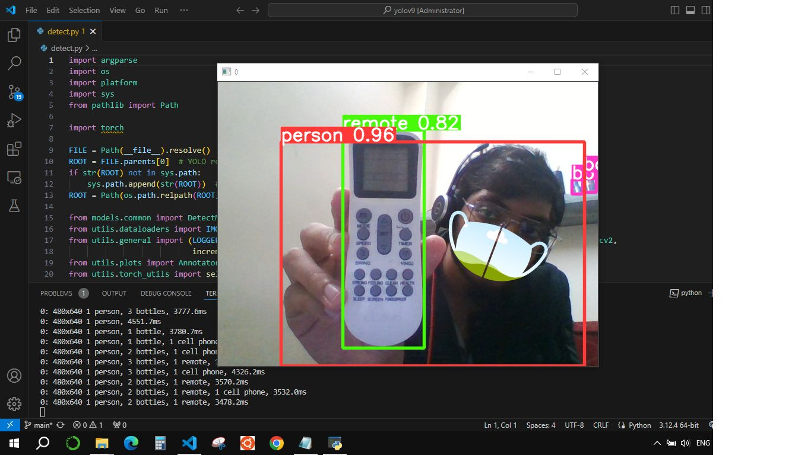
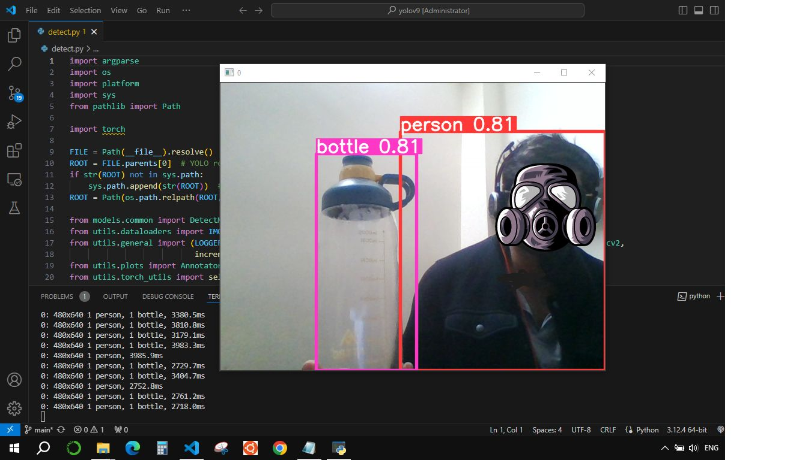
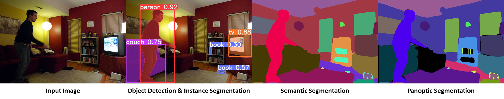

# YOLOv9


## OUTPUT

<div align="center">
    <a href="./">
        
    </a>
    <a href="./">
        
    </a>
    <a href="./">
        
    </a>
</div>


<div align="center">
    <a href="./">
        
    </a>
</div>

<div align="center">
    <a href="./">
        
    </a>
</div>

## Installation

Python 3.12.4 (Recommended)
<details><summary> <b>Expand</b> </summary>

``` shell
# clone the repository in your local system.
git clone https://github.com/Ibaad-AhmedAjaz/Object-Detection-using-YOLOV9.git

# go to code folder
cd /yolov9

# pip install required packages
pip install seaborn thop
pip install -r requirements.txt

run the code!


# create the docker container, you can change the share memory size if you have more.
nvidia-docker run --name yolov9 -it -v your_coco_path/:/coco/ -v your_code_path/:/yolov9 --shm-size=64g nvcr.io/nvidia/pytorch:21.11-py3

# apt install required packages
apt update
apt install -y zip htop screen libgl1-mesa-glx


```

</details>


## Evaluation
Download Any one of these below pre-trained models and store the model in your project folder (yolov9).
I have used gelan-c.pt pre-trained model.

[`yolov9-s-converted.pt`](https://github.com/WongKinYiu/yolov9/releases/download/v0.1/yolov9-s-converted.pt) [`yolov9-m-converted.pt`](https://github.com/WongKinYiu/yolov9/releases/download/v0.1/yolov9-m-converted.pt) [`yolov9-c-converted.pt`](https://github.com/WongKinYiu/yolov9/releases/download/v0.1/yolov9-c-converted.pt) [`yolov9-e-converted.pt`](https://github.com/WongKinYiu/yolov9/releases/download/v0.1/yolov9-e-converted.pt) 
[`yolov9-s.pt`](https://github.com/WongKinYiu/yolov9/releases/download/v0.1/yolov9-s.pt) [`yolov9-m.pt`](https://github.com/WongKinYiu/yolov9/releases/download/v0.1/yolov9-m.pt) [`yolov9-c.pt`](https://github.com/WongKinYiu/yolov9/releases/download/v0.1/yolov9-c.pt) [`yolov9-e.pt`](https://github.com/WongKinYiu/yolov9/releases/download/v0.1/yolov9-e.pt) 
[`gelan-s.pt`](https://github.com/WongKinYiu/yolov9/releases/download/v0.1/gelan-s.pt) [`gelan-m.pt`](https://github.com/WongKinYiu/yolov9/releases/download/v0.1/gelan-m.pt) [`gelan-c.pt`](https://github.com/WongKinYiu/yolov9/releases/download/v0.1/gelan-c.pt) [`gelan-e.pt`](https://github.com/WongKinYiu/yolov9/releases/download/v0.1/gelan-e.pt)

``` shell
# evaluate converted yolov9 models
python val.py --data data/coco.yaml --img 640 --batch 32 --conf 0.001 --iou 0.7 --device 0 --weights './yolov9-c-converted.pt' --save-json --name yolov9_c_c_640_val

# evaluate yolov9 models
# python val_dual.py --data data/coco.yaml --img 640 --batch 32 --conf 0.001 --iou 0.7 --device 0 --weights './yolov9-c.pt' --save-json --name yolov9_c_640_val

# evaluate gelan models
# python val.py --data data/coco.yaml --img 640 --batch 32 --conf 0.001 --iou 0.7 --device 0 --weights './gelan-c.pt' --save-json --name gelan_c_640_val
```

You will get the results:

```
 Average Precision  (AP) @[ IoU=0.50:0.95 | area=   all | maxDets=100 ] = 0.530
 Average Precision  (AP) @[ IoU=0.50      | area=   all | maxDets=100 ] = 0.702
 Average Precision  (AP) @[ IoU=0.75      | area=   all | maxDets=100 ] = 0.578
 Average Precision  (AP) @[ IoU=0.50:0.95 | area= small | maxDets=100 ] = 0.362
 Average Precision  (AP) @[ IoU=0.50:0.95 | area=medium | maxDets=100 ] = 0.585
 Average Precision  (AP) @[ IoU=0.50:0.95 | area= large | maxDets=100 ] = 0.693
 Average Recall     (AR) @[ IoU=0.50:0.95 | area=   all | maxDets=  1 ] = 0.392
 Average Recall     (AR) @[ IoU=0.50:0.95 | area=   all | maxDets= 10 ] = 0.652
 Average Recall     (AR) @[ IoU=0.50:0.95 | area=   all | maxDets=100 ] = 0.702
 Average Recall     (AR) @[ IoU=0.50:0.95 | area= small | maxDets=100 ] = 0.541
 Average Recall     (AR) @[ IoU=0.50:0.95 | area=medium | maxDets=100 ] = 0.760
 Average Recall     (AR) @[ IoU=0.50:0.95 | area= large | maxDets=100 ] = 0.844
```


## Training

Data preparation

``` shell
bash scripts/get_coco.sh
```

* Download MS COCO dataset images ([train](http://images.cocodataset.org/zips/train2017.zip), [val](http://images.cocodataset.org/zips/val2017.zip), [test](http://images.cocodataset.org/zips/test2017.zip)) and [labels](https://github.com/WongKinYiu/yolov7/releases/download/v0.1/coco2017labels-segments.zip). If you have previously used a different version of YOLO, we strongly recommend that you delete `train2017.cache` and `val2017.cache` files, and redownload [labels](https://github.com/WongKinYiu/yolov7/releases/download/v0.1/coco2017labels-segments.zip) 

Single GPU training

``` shell
# train yolov9 models
python train_dual.py --workers 8 --device 0 --batch 16 --data data/coco.yaml --img 640 --cfg models/detect/yolov9-c.yaml --weights '' --name yolov9-c --hyp hyp.scratch-high.yaml --min-items 0 --epochs 500 --close-mosaic 15

# train gelan models
# python train.py --workers 8 --device 0 --batch 32 --data data/coco.yaml --img 640 --cfg models/detect/gelan-c.yaml --weights '' --name gelan-c --hyp hyp.scratch-high.yaml --min-items 0 --epochs 500 --close-mosaic 15
```

Multiple GPU training

``` shell
# train yolov9 models
python -m torch.distributed.launch --nproc_per_node 8 --master_port 9527 train_dual.py --workers 8 --device 0,1,2,3,4,5,6,7 --sync-bn --batch 128 --data data/coco.yaml --img 640 --cfg models/detect/yolov9-c.yaml --weights '' --name yolov9-c --hyp hyp.scratch-high.yaml --min-items 0 --epochs 500 --close-mosaic 15

# train gelan models
# python -m torch.distributed.launch --nproc_per_node 4 --master_port 9527 train.py --workers 8 --device 0,1,2,3 --sync-bn --batch 128 --data data/coco.yaml --img 640 --cfg models/detect/gelan-c.yaml --weights '' --name gelan-c --hyp hyp.scratch-high.yaml --min-items 0 --epochs 500 --close-mosaic 15
```

## Inference

<div align="center">
    <a href="./">
        
    </a>
</div>

``` shell
# inference converted yolov9 models
python detect.py --source './data/images/horses.jpg' --img 640 --device 0 --weights './yolov9-c-converted.pt' --name yolov9_c_c_640_detect

# inference yolov9 models
# python detect_dual.py --source './data/images/horses.jpg' --img 640 --device 0 --weights './yolov9-c.pt' --name yolov9_c_640_detect

# inference gelan models
# python detect.py --source './data/images/horses.jpg' --img 640 --device 0 --weights './gelan-c.pt' --name gelan_c_c_640_detect
```

